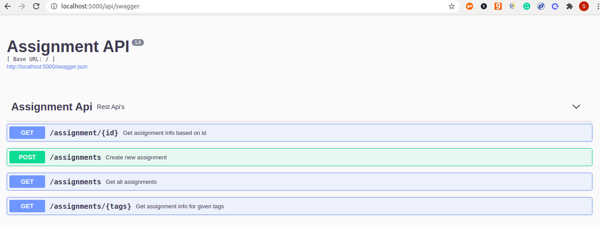

# assignment_service

*Rest Api's are build using flask_rest_plus and sqlalchemy*

**Requirements**

1. docker
2. docker-compose

**Steps to run project in local**

1. Clone the project
2. build docker using ```docker-compose build```
3. Run tests using ```docker-compose run test```
4. Run application using ```docker-compose up app```
5. swagger UI ```http://localhost:7000/api/swagger```

***Apis***

1. ```/assignments``` - ```GET``` Get all assignments
2. ```/assignments``` - ```POST``` Create an assignment
3. ```/assignment/<int:id>``` - ```GET``` Get assignment by id
4. ```/assignments/<tags>``` - ```GET``` Get assignments by tags

**Swagger UI**



***Thank You!!!***
